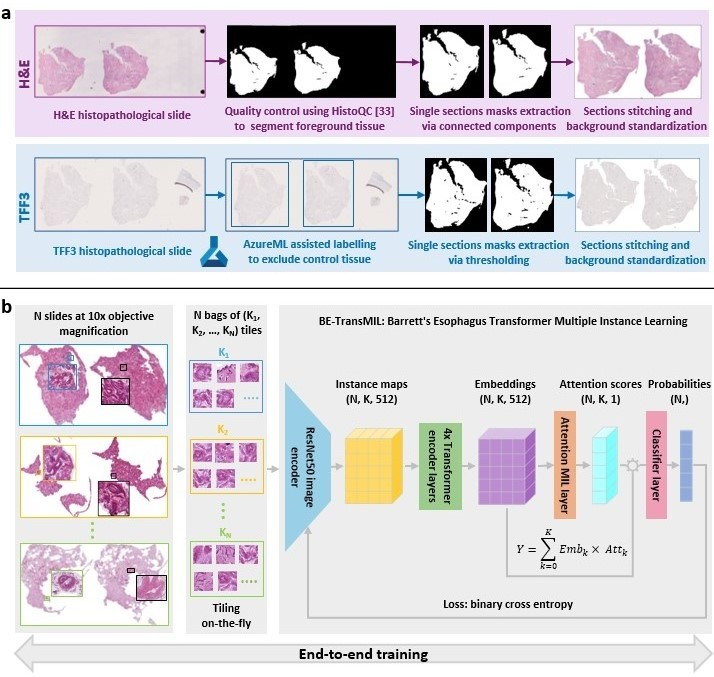

# Code to accompany the paper "Enabling large-scale screening of Barrett's esophagus using weakly supervised deep learning in histopathology"

This repository contains the code to accompany the paper ["Enabling large-scale screening of Barrett's esophagus using
weakly supervised deep learning in histopathology"](https://www.medrxiv.org/content/10.1101/2023.08.21.23294360v1)
The work arose from a collaboration between [Cyted](https://www.cyted.ai/) and [Microsoft Health
Futures](https://www.microsoft.com/en-us/research/lab/microsoft-health-futures/).



The repository contains:

* Code and instructions to pre-process the data from Cyted
* Instructions to train a model using the [hi-ml](https://github.com/microsoft/hi-ml) toolbox
* Code and instructions to analyse the results of the trained model

The code is not intended to be a general-purpose
library, but rather a record of the code that was used for the paper. Consequently, the code and editor setup
at many places contains hard-coded paths and other parameters that are specific to the paper and/or the Azure
setup that our team used, like the names of the AzureML compute clusters, dataset folder, AzureML run IDs, checkpoint
names, and others.

## Disclaimer

The software described in this repository is provided for research and development use only. The software is not intended for use in clinical decision-making or for any other clinical use, and the performance of model for clinical use has not been established. You bear sole responsibility for any use of this software, including incorporation into any product intended for clinical use.

## Getting Started

We recommend using VSCode for development. You can install VSCode from https://code.visualstudio.com/.

You can clone repository right from within VSCode by selecting "Git: Clone" from the command palette. This will also
handle the authentication for you.

After cloning the repository, you will need to ensure that the `hi-ml` package is correctly available as a submodule, by running:

```shell
git submodule init
git submodule update
```

Then create a Conda environment `HimlHisto` by running:

```bash
make env
```

You can then activate the environment via `conda activate HimlHisto`.
Set VSCode to use this Conda environment, by choosing "Python: Select Interpreter" from the command palette.

## Workflow for model building and evaluation

* [Azure setup](docs/azure_setup.md)
* [Quality control](docs/quality_control.md)
* [Building a model for H&E slides](docs/he_workflow.md)
* [Building a model for TFF3 slides](docs/tff3_workflow.md)
* [Evaluating a trained model on a holdout dataset](docs/external_validation.md)

## Data files

The code relies on data files that we are not able to share here in this repository:

- A file that contains bounding boxes of control tissue on TFF3 slides
  (`tff3_control_tissue_exclusion_via_aml_labelling`). This file was created by running an AzureML labelling project to
  identify control tissue in the IHC slides.

## Contributing

This project welcomes contributions and suggestions.  Most contributions require you to agree to a
Contributor License Agreement (CLA) declaring that you have the right to, and actually do, grant us
the rights to use your contribution. For details, visit https://cla.opensource.microsoft.com.

When you submit a pull request, a CLA bot will automatically determine whether you need to provide
a CLA and decorate the PR appropriately (e.g., status check, comment). Simply follow the instructions
provided by the bot. You will only need to do this once across all repos using our CLA.

This project has adopted the [Microsoft Open Source Code of Conduct](https://opensource.microsoft.com/codeofconduct/).
For more information see the [Code of Conduct FAQ](https://opensource.microsoft.com/codeofconduct/faq/) or
contact [opencode@microsoft.com](mailto:opencode@microsoft.com) with any additional questions or comments.

## Trademarks

This project may contain trademarks or logos for projects, products, or services. Authorized use of Microsoft
trademarks or logos is subject to and must follow
[Microsoft's Trademark & Brand Guidelines](https://www.microsoft.com/en-us/legal/intellectualproperty/trademarks/usage/general).
Use of Microsoft trademarks or logos in modified versions of this project must not cause confusion or imply Microsoft sponsorship.
Any use of third-party trademarks or logos are subject to those third-party's policies.
