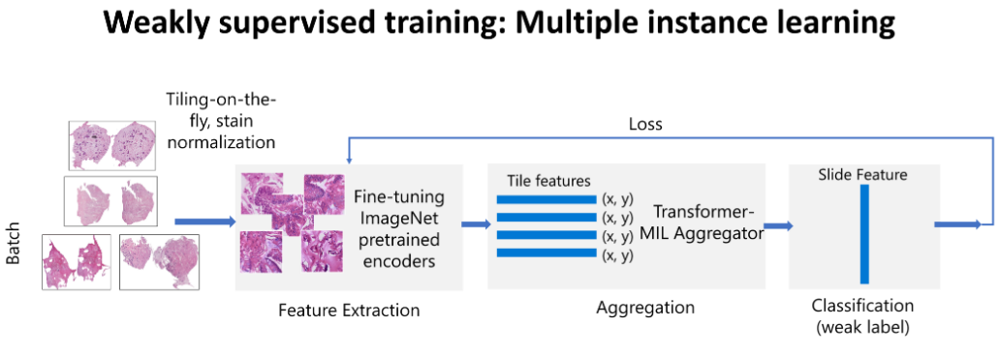

# Workflow for Training and Testing H&E Models

This documents contains detailed instructions to reproduce the best benchmaked model to predict the "TFF3 positive" label from H&E slides.

# H&E Data Preprocessing

First, make sure to follow [Azure Instructions](azure_setup.md) to be able to run the preprocessing in the cloud.

Follow the steps below to create the preprocessed whole slide dataset. The steps are:

- Run HistoQC to extract foreground/background masks from the H&E slides. This can be done best on a compute instance in
  Azure.
- Extract bounding boxes from the foreground masks, that identify the two large tissue regions. Again, this can be done
  on a compute instance in Azure. The bounding boxes are stored as a JSON file, that can be checked into this repository.
- Re-write the slides, to contain only the foreground regions, and to only contain one magnification level. This greatly
  reduces the dataset size, and makes training a lot faster. This step can be run in the cloud as an AzureML job.

## Run HistoQC

- Group slides by stain type, as described in the [quality control section](quality_control.md). This will create a
  folder `~/cyted-temp/he_slides_only` that contains all the H&E slides.
- Clone histoQC as described in [hi-ml docs](https://hi-ml.readthedocs.io/en/latest/histoqc.html).
- In the text below, we will assume that the repo is cloned in `~/HistoQC`.
- Modify the HistoQC config file to remove the blur detection and pen marking modules: Comment out lines 4 and 16 in
  `~/HistoQC/histoqc/config/config_v2.1.ini`
- Create the `histoqc` conda environment as described in [hi-ml
  docs](https://hi-ml.readthedocs.io/en/latest/histoqc.html).
- Install `HistoQC` in editable mode, by running `pip install -e .` in the `~/HistoQC` folder.
- Run HistoQC on the H&E slides, using the following commandline. This will create a folder `/cyted/histoqc_he_slides` that
  contains the masks for each slide.
- Note: **With this setup, HistoQC will writes its results directly back to Azure
  blob storage**. If you re-run HistoQC, it will overwrite the existing results. Please modify the output folder if you
  want to run HistoQC on a new dataset, for example.

```shell
 python -m histoqc -c ~/HistoQC/histoqc/config/config_v2.1.ini -n 4 "~/cyted-temp/he_slides_only/*.ndpi" -o /cyted/histoqc_he_slides
 ```

## Extract Bounding Boxes from H&E HistoQC masks

Next, usable tissue bounding boxes can be created from the HistoQC masks in order to [crop the original slides](he_workflow.md#crop-the-he-slides).

Bounding boxes for Delta cohort can be generated by running the following commandline from the repository root:

```shell
python cyted/preproc/generate_he_bboxes.py --masks_dir=/cyted/histoqc_he_slides --bbox_json=he_bboxes_from_histoqc_masks.json
```

This will create a JSON file with the bounding boxes, located at the repository root. Note: The file needs to be written
into the folder structure of the repository so that, in the next step, it can be uploaded to Azure alongside the code.

## Crop the H&E Slides

The next step is to reduce the size of the H&E slides, by taking only the two tissue sections that are of interest.
This uses the bounding boxes that were extracted in the previous step.

- In addition, the script re-writes the NDPI files as TIFF files with only one specific magnification level. This greatly reduces
  the file size, and consequently the time it takes to load them for training.
- The script also standardizes the background of the slides, by setting all pixels that are not in the tissue sections to white.
  The decision about foreground/background is based on the masks that are created by HistoQC.

Run the following commandline to create preprocessed H&E dataset at 10x in Azure, adjusting the following parameters:

- `--docker_shm_size=900g` to set the Docker memory size for your job to 900G. 900G is suitable for compute clusters with A100
  machines.
- `--cluster=<cluster_name>` to set the name of your compute cluster.
- `mask_dataset=histoqc_he_slides` sets the name of the folder in blob storage that contains the HistoQC masks. This
  must match the name of the folder used above in the "Run HistoQC" step.
- `--bounding_box_path=he_bboxes_from_histoqc_masks.json` sets the name of the JSON file that contains bounding boxes.
  Again, this must match the file name used in the "Extract Bounding Boxes" step.

```shell
python cyted/preproc/crop_and_convert_ndpi_to_tiff.py \
  --image_column="H&E" \
  --dataset=cyted-raw-20221102 \
  --target_magnifications=10.0 \
  --num_workers=20 \
  --automatic_output_name=True \
  --display_name=preprocess_he_slides \
  --dataset_csv=reviewed_dataset_2023-02-10.tsv \
  --converted_dataset_csv=dataset.tsv \
  --bounding_box_path=he_bboxes_from_histoqc_masks.json \
  --mask_dataset=histoqc_he_slides \
  --datastore=cyted \
  --docker_shm_size=<vm_ram_size> \
  --cluster=<cluster_name> \
```

This scripts runs directly in AzureML so the preprocessed data will be stored in blob storage automatically.

For a full documentation of the parameters, run `python cyted/preproc/crop_and_convert_ndpi_to_tiff.py --help`

We recommand not setting `--output_dataset` for the delta cohort to match the dataset names set in `cyted/data_paths.py`

Make sure to `--docker_shm_size` to the VM RAM size to be able to use all cpu cores set via `--num_workers` argument.

# Create an Overview Image of the Dataset

As a next step, we suggest to create a montage of all slides in the dataset. A montage is a huge image that contains
thumbnails of all the slides in the dataset. This can be useful to get an overview of the dataset, and to check if
all the conversion steps worked as expected.

A montage can be created by running this command:

```shell
python hi-ml/hi-ml-cpath/src/health_cpath/scripts/create_montage.py --dataset preprocessed_h_e_10.0x --image_glob_pattern="**/*.tiff"--cluster=<cluster_name>
```

This job will create two files, `montage.png` and `montage.jpg`. Download them to your local machine and use a viewer
that can handle very large images (the default width is 60_000) to inspect them.

# Running Training

To run training, you need to have a GPU-enabled AzureML compute cluster. For local development work, a workstation or VM with a GPU
can be utilized too.

To create a compute cluster, see the [hi-ml docs](https://hi-ml.readthedocs.io/en/latest/azure_setup.html) for instructions.

Once a compute cluster is available, you can run training as follows:

```shell
python runner.py --model cyted.TFF3_HECytedMIL --cluster=<mygpucluster> --mount_in_azureml --model_variant=cyted --strictly_aml_v1 --docker_shm_size=900g
```

You need to replace `mygpucluster` with the name of your compute cluster. The `--mount_in_azureml` flag is required to
fit the dataset to compute nodes that do not have a large enough local disk. You can drop it if you have a compute node
with at least 1TB of local disk space.

All model and training parameters can be changed on the command line. See `python runner.py --help` for a list of all parameters.
Here are a few particularly helpful ones:

- `--max_epochs=1`: Only run for one epoch. This is helpful to speed up training runs for debugging purposes.
- `--crossval_count=5`: Start 5-fold cross validation. This will queue 5 training runs, each with a different fold as validation set.
- `--pl_limit_train_batches=2`: Limit the number of training batches to 2. Again, this is helpful for debugging.
- `--max_bag_size=3`: Change the number of tiles in a bag during training.
- `--max_bag_size_inf=3`: Change the number of tiles in a bug during whole slide inference
- `--batch_size=2`: Change the number of tiles in a bag during training.
- `--batch_size_inf=2`: Change the number of tiles in a bag during whole slide inference.

# Reproducing Barrett's MIL best benchmark

The table below summarizes the expected results for the best benchmarked model using [1st fold](<https://ml.azure.com/experiments/id/e243f88b-e677-4fc5-bbff-f09d433ccf9a/runs/HD_81ad64b5-e03a-4373-9387-235a224314c8_1?wsid=/subscriptions/db9fc1d1-b44e-45a8-902d-8c766c255568/resourcegroups/innereyerg/workspaces/innereye4ws&tid=72f988bf-86f1-41af-91ab-2d7cd011db47#metrics>)
split of a 5-fold cross validation run.

| Model Description |                                      |                   |                     | Metrics   |        |             |        |
| ----------------- | ------------------------------------ | ----------------- | ------------------- | --------- | ------ | ----------- | ------ |
| Encoder           | Pooling                              | Bag size training | Bag size validation | Accuracy  | Auroc  | Specificity | Recall |
| Resnet 50         | 4 Transformer layers + Attention MIL | 2500              | 5000                | V: 0.9071 | 0.9360 | 0.9823      | 0.7857 |
|                   |                                      |                   |                     | T: 0.8733 | 0.8549 | 0.9366      | 0.7701 |

Bag size stands for the number of tiles sampled from the slide on the fly.

V: stands for validation results and T: test performance

All settings have been adjusted for Resnet50 in `cyted.TFF3_HECytedMIL_Resnet50` container config to reproduce the results above. Simply run the following commandline:

```shell
python runner.py --model=cyted.TFF3_HECytedMIL_Resnet50 --cluster=<mygpucluster> --mount_in_azureml --model_variant=cyted --strictly_aml_v1 --docker_shm_size=900g
```

You can learn more about the model architecture and technical details in the sections below.

## Model description

An image encoder is used to extract tile level feature maps. The tile embeddings are then pooled and fed to a classifier
to predict the label of the WSI. For our model architectures, we experimented with three encoders (ResNet18, ResNet50,
SwinTransformer Tiny) followed by the transformer pooling layer, which is inspired by the model architecture
TransformerMIL in (Myronenko et al. 2021). The figure below outlines the model architecture.


## Technical details

### Activation checkpointing

[Activation checkpoiting](https://pytorch.org/docs/stable/checkpoint.html) of the image encoder is used to reduce memory
consumption during training to be able to process larger bags of tiles per slide. To activate encoder checkpointing the
following flags need to be activated:

- `pl_static_graph=True` this is important as DDP training doesn't support unused parameters in the computational
  graph unless it's running in static_graph mode.
- `use_encoder_checkpointing=True` to enable encoder checkpoitning.
- `batchnorm_momentum=0.1` checkpointing applies the forward pass twice which leads to double updates of batch norm
  statistics. We found empirically that setting batch norm momentum to 0.1 with checkpoiting works best.

### Adjusting effective batch size to 8

The results above have been obtained using N=8 GPUs for 50 epochs. The batch size per gpu is set to 1 by default which
makes the effective batch size = 8. Gradient accumulation can be used to adjust the effective batch size to 8 if the compute
cluster has M < 8. For M=4, we added the following to the Cyted model variant:

- `pl_accumulate_grad_batches=2` this will reduce gradients every 2 epochs making the effective batch size equal to
4x2=8.
